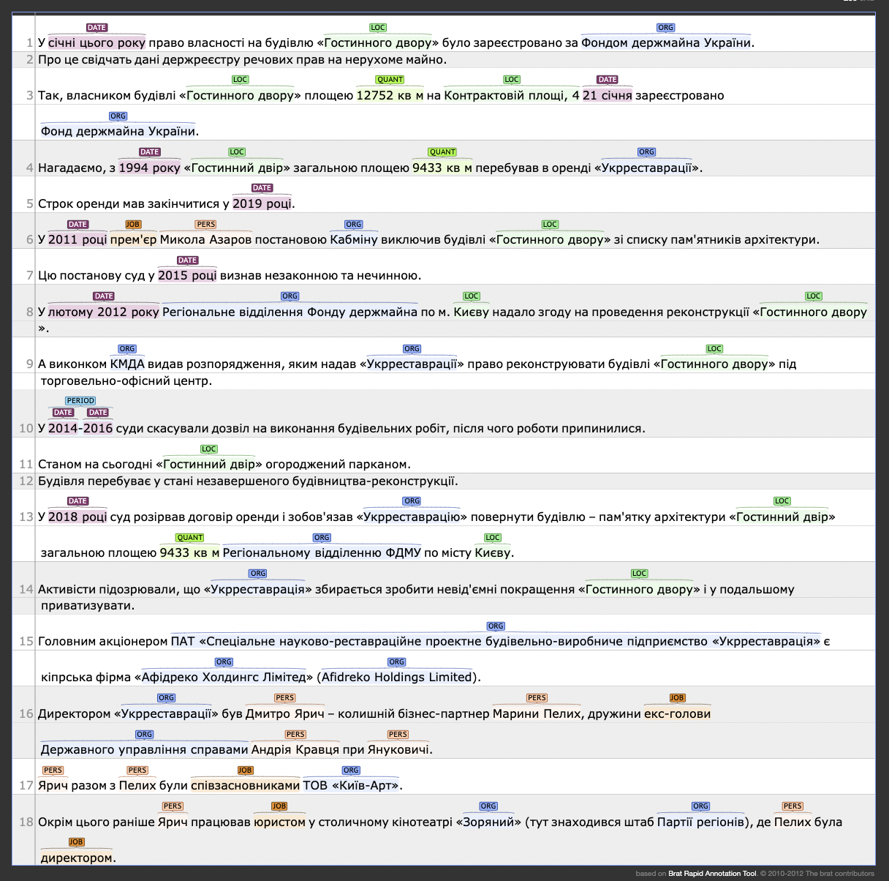

# Інструкція з NER-розмітки тексту

(Версія 2016-04-29)

NER — це назва, яка вказує на певну унікальну сутність. До них відносяться імена осіб, назви місцевостей, організацій, творів, веб-сайтів і т.і.
Вона складається з одного або декількох слів. Будь-яка NER-сутність має містити хоча б одне слово з великої літери або написане іншою мовою (виключення можуть скаладати випадки, коли допущена помилка написання чи весь текст приведений до одного регістру). Але деякі сутності можуть містити також і слова з маленької літери (`Маркіз де Сад`, `Кримінальний кодекс України`, `поліклініка №3`).

До NER не відносяться і, відповідно, не виділяються:

- звичайні іменники, які по тим чи іншим причинам написані з великої літери
- в тому числі також назви хвороб, місяців, посад, сортів рослин, тварин і т.п. назви, які пишуться з маленької літери (але помилково можуть також бути написані з великої літери)
- загальноприйняті абревіатури звичайних іменників, які не вказують на унікальну сутність: `ЗМІ`, `ВНЗ`, `БТІ` (але `ООН`, `НАТО` — це NER)
- нові власні іменники, які стали загальновживаними: "компанія Facebook" (`Facebook` - це NER), "у своєму Фейсбуку" (тут `Фейсбуку` це вже не NER)
- прикметники або іменники, які є похідними від NER-сутностей: `кіровоградський`, `УДАРівці`
- дати, суми, інші числа

## Загальні правила анотації

- одна сутність має бути неперервною: `Тарас Шевченко`, а не окремо `Тарас` і `Шевченко`, `Тернопільска міська рада`
- дві сутності, що стоять поряд, мають бути виділені окремо. Приклад: "спікер Верховної Ради Гройсман" - тут `Верховної Ради` — це окрема сутність типу *ОРГ*, `Гройсман` — окрема типу *ПЕРС* 
- якщо назва повністю знаходить в лапках (приклад: "картина «Ніч на Дніпрі»", `картина` не є частиною NER-сутності), то виділяти її без лапок (тільки слова), якщо ж назва включає слово в лапках, то виділяти також і лапки (`Школа-інтернат "Барвінок"` — все повністю NER-сутність)
- якщо одна сутність є частиною іншої (як правило, це стосується географічних назв), то додатково виділити її не треба ("картина «Ніч на Дніпрі»": `Ніч на Дніпрі` — це сутність типу *РАЗН*, слово `Дніпрі` окремо не виділяємо)
- при анотації дуже важливо дотримуватись однакових підходів до виділення та класифікації подібних сутностей, бути уважними і педантичними

## Типи сутностей

- *ОРГ* (організація) — назва будь-якої компанії, організації, установи, партії, гурту, об'єднання людей, а також певних проектів (фестиваль, програма на телебаченні тощо). Приклади: `ЮНЕСКО`, `INSIDER`, `Україньска правда`, `КМДА`, `Київський міський ордена Трудового червоного гудзика музей космонавтики ім. С.П. Корольова` і т.і. *ОРГ* може включати досить багато слів, частина яких пишеться з маленької літери. Але, як правило, такі сутності мають виділятись як локація (*ЛОК*). Окремі підрозділи організацій (наприклад, "інформаційний департамент Національної гвардії") не входять у NER-назву, тобто треба виділяти тільки назву самої організації організацію (тут — `Національної гвардії`). Як правило, це можна розрізнити по використанню великої літери (тобто `Головне управління МВС України в м.Києві` є сутністю повністю, а якщо використовується словосполучення "управління МВС України", то сутність в ньому — це тільки `МВС України`).
- *ПЕРС* (персона) — ім'я будь-якої персони (людини, персонажа, тварини), може складатися з декількох власних іменників, всі з яких, як правило, пишуться з великої літери. Виключення є ситуації, коли саме ім'я включає якийсь титул: `Маркіз де Сад` (але не `пан Андрій` чи `лікар Френк` — в загальному випадку назви посад або роповсюдженні звертання не включаються до імені, тобто сутності тут будуть `Андрій` та `Френк`). Особливий випадок, це коли імена декількох осіб пишуться разом з одним прізвищем: `Андрій і Тарас Шевченко` — тут треба виділити всі 4 слова як одну сутність.
- *ЛОК* (локація) — будь-які географічні назви, в тому числі назви країн (`CША`, `Вигурівщина`, `р. Ворскла`), топоніми (`Будинок Офіцерів`), адреси (`вул. Хрещатик 1`). У випадку, коли назва країни ("Росія напала на Україну"), міста ("позиція офіційного Вашингтону") чи топоніма ("гвардія Майдану") використовується у якості політичного суб'єкту, це все одно виділяється як сутність типу *ЛОК*.
- *РАЗН* (все інше) — інші сутності, які не входять до перелічених вище: назви творвй мистецтва ("казка «Вовк і семеро козлят»" — тут сутність — це `Вовк і семеро козлят` без слова казка), законів та інших юридичних документів (`КПК України`, `П.27 Договору`), торгівельних марок і подібні їм (сорт рослини `Chameleon`, літак `Боїнг`), веб-сайтів (`rada.gov.ua`). Якщо не зрозуміло, що за сутність, то треба відносити її до цієї категорії.

## Приклади анотацій з роз'ясненнями

- `Тувім` (*РАЗН*) — не зрозуміло, це ім'я людини, стиль поезії чи щось ще
- премія в царині дитячої літератури "Великий Іжак" — NER `Великий Іжак` як *ОРГ*, бо премія — це певна установа
- у той же час `Стежка вздовж ріки` — *РАЗН*, бо це твір
- `Магдалини` (*ПЕРС*) — бо тут це просто ім'я, а не назва твору
- `ТУГи` (*ОРГ*) — бо в цьому контексті зрозуміло, що це скорочення від `Товариство Усамітнених Графоманів`. В той же час, якщо "Товариство Усамітнених Графоманів" — це назва твору, то правильна анотація для обох вживань — *РАЗН*

---

- `Боїнги`, `ТУшки`, `Ани`, `Яки` (*РАЗН*) — моделі літаків
- `СРСР` (*ЛОК*) — назва країни

---

- `Микола та Лариса Онули` (*ПЕРС*) — виділено разом, щоб не втратити інформацію, що Микола теж Онул (ці сутності будуть потім розділені автоматично під час пост-обробки отриманих даних)
- `100-й округ` (*ОРГ*) — бо це юридична сутність/в певній мірі установа

---

- село `Шевченкове` `Звенигородського району` (*ЛОК*) — виділено 2 окремі сутності
- `Наймичка` (*РАЗН*) — назва твору

---

- лікарні, поліклініка виділені, бо вони мають номери, тобто це назва конкретної установи. В ідеалі, вони мали б писатись з великої літери

---

- вірус `Ньюкасла` виділено окремо як *РАЗН*, бо назви хвороб ми не виділяємо, але в цьому випадку NER-сутність, яка є частиною назви хвороби, втрачає своє первинне значення як *ЛОК* (або *ПЕРС* — в даному випадку не відомо, бо це може бути і прізвище вченого, як у випадку "Альцгеймера")

---

- фестиваль — *ОРГ*
- `Софія`/`Sofia` (*ОРГ*) — тому що у даному випадку це назва музичної групи чи проекту

---

- `ОЕ`, `Океанів` (*ОРГ*) — різні варіації назви музичного гурту
- CD `Sofiya` (*РАЗН*), тому що в даному випадку йдеться вже не про гурт, а про однойменний твір

---

- зверніть увагу на тегування програм
- `Митний союз’ (*ЛОК*), бо це гео-політичне утворення

---

- повна і скорочена назва `ЕРП` виділені окремо
- `Вінницької, Дніпропетровської ... областях` (*ЛОК*) — виділено разом, бо всі назви мають містити слово область (ці сутності будуть потім розділені автоматично під час пост-обробки отриманих даних)

## Що треба зробити?

1. У вікні браузера виділяти мишкою NER-сутності і вказувати відповідний тип

    

2. Для видалення помилкової анотації треба виділити анотацію, подвійно клікнути на неї, а потім натиснути кнопку "Видалити"

    

3. Після закінчення роботи зі всім фрагментом тексту повторно перевірити, чи нічого не пропущено і чи правильно розставлені всі анотації, після чого відправити їх на сервер
