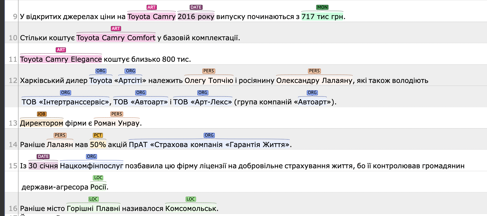
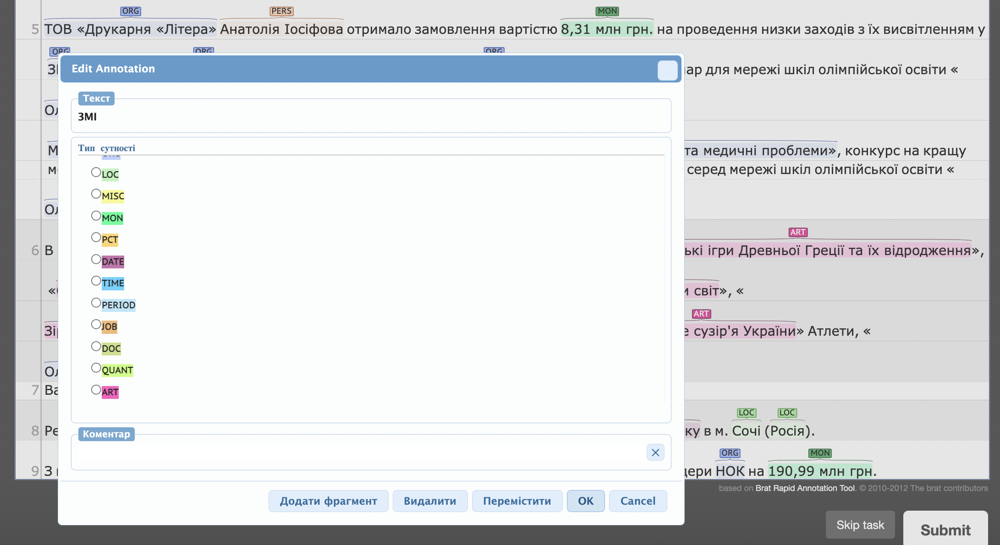

# Instructions for NER markup of text

(Version 2022-03-27)

A Named Entity (NE) is a name that refers to a specific, unique entity. Entities include names of people, places, organizations, works, websites, etc.

An entity consists of one or more words and may also contain punctuation (quotation marks or commas). Most entities start with a capitalized word, although entities can also contain lowercase words (`Marquis de Sade`, `Criminal Code of Ukraine`, `Polyclinic №3`, `People's Deputy`, `June 2020`). There are also cases when a spelling mistake is made or the entire text is converted to the same case.

Named entities do not belong to named entities and, accordingly, are not distinguished:

- common nouns that are capitalized for one reason or another;
- names of diseases, plant varieties, animals, and other names that are capitalized (but may also be capitalized by mistake)
- common abbreviations of common nouns that do not indicate a unique entity: `Media', `University', `BTI', `JSOC' (but `UN', `NATO' are entities);
- new proper nouns that have become commonly used: "the Facebook company" (`Facebook' is an entity), "on his Facebook" (here `Facebook' is no longer an entity);
- adjectives or nouns that are derived from named entities: `Kirovohrad', `Udar', `SBUchnik' (however, different cases of the same noun remain entities - for example, in the phrase `Natasha's mom', `Natasha' is *PERS*).

## General rules of annotation

- One entity must be continuous: `Taras Shevchenko`, not separately `Taras` and `Shevchenko`, `Ternopil City Council`.
- Different entities standing next to each other should be separated. Example: "Speaker of the Verkhovna Rada Groysman" - here `Speaker` is a separate entity of type *JOB*, `Verkhovna Rada` is a separate entity of type *ORG*, `Groysman` is a separate entity of type *PERS*.
- If the name is completely in quotation marks (example: "painting "Night on the Dnipro"", "painting" is not part of the entity), then highlight it without quotation marks (only words). If the title contains a word in quotation marks, then also highlight the quotation marks (example: `Barvinok boarding school`, `Salang LLC` - all words are part of the entity).
- If one entity is a part of another (as a rule, this applies to place names), then it does not need to be separated ("the painting 'Night on the Dnipro'": `Night on the Dnipro' is an entity of type *ART*, the word `Dnipro' is not separated). Exceptions are *DOC* entities that contain the date of the contract/document as an integral part of the document name, as well as *PERIOD* entities that may also contain two separate dates.
- Some abbreviations within an entity may end with a period. If the period also marks the end of a sentence, you do not need to capture it. If the abbreviation with a period occurs in the middle of a sentence, then it should be captured. For example: "...from `10 million UAH to `15 million UAH."
- When annotating, it is very important to follow the same approaches to the selection and classification of similar entities, to be attentive and meticulous.

## Entity types

- *ORG* (organization) - the name of any company, brand, agency, organization, institution (including religious, informal, non-profit), party, group, association of people, as well as certain projects (festivals, conferences, television programs, etc.). Examples: UNESCO, INSIDER, Ukrainska Pravda, Kyiv City State Administration, Rivne Nuclear Power Plant, Kyiv City Order of the Red Button of Labor Museum of Cosmonautics named after S.P. Korolev, etc. *ORG* can include quite a few words, some of which are written with a lowercase letter. Separate subdivisions of organizations (for example, "department of the National Guard") are not included in the entity, i.e., only the name of the organization itself (here, the National Guard) should be highlighted. As a rule, this can be distinguished by the use of a capital letter: `The Main Directorate of the Ministry of Internal Affairs of Ukraine in Kyiv' is the entire entity, and if the phrase `the Directorate of the Ministry of Internal Affairs of Ukraine' is used, then the entity is only the `MIA of Ukraine'.
- PERS* (person) - the name of any person (human, character, animal, humanoid character such as a vampire, spirit, mermaid, etc.). A name can consist of several proper nouns, all of which are usually capitalized. The exception is when the name itself includes a title: `Marquis de Sade` (but not `Mr. Andrew` or `Dr. Frank` - in general, titles or common addresses are not part of the name, i.e. the entities here would be `Andrew` and `Frank`). A special case is when the names of several people are written together with one surname: "Andriy and Taras Shevchenko" - here you need to select all 4 words as one entity.
- *LOC* - any geographical names: districts, settlements and large cities, regions/states/counties/regions, names of rivers, mountains, lakes, seas, oceans, mountain ranges, water areas, countries, continents. For example: 'USA', 'Vyhurivshchyna', 'Vorskla', 'Officers' House', 'Lviv region', 'Shevchenkivskyi district', 'Maryanske-Beryslav' (as a road name), addresses (1 Khreshchatyk Street), buildings and structures with their own name (airports, bridges, aqueducts). Common words such as 'village', 'city', 'town' are not part of the entity, but 'oblast', 'rayon' and 'st' are included because they are part of the name. In the case when the name of a country ("Russia attacked Ukraine"), city ("the position of official Washington") or other place name ("Maidan Guard") is used as a political entity, it is still distinguished as an entity of type *LOC*.
- *MON* - monetary amounts including currency. For example: `1000 hryvnias`, `500 hryvnias`, `1000 (one thousand) hryvnias`, `one million hryvnias`, `$400,000`, `$400,000`, `15-16 billion hryvnias`, `one million three hundred and fifty-five thousand hryvnias 77 kopecks`, `$1.5 million`, `200 thousand`, `57898490,55 (fifty-seven million eight hundred and ninety-eight thousand four hundred and ninety hryvnias 55 kopecks) hryvnias`.
- PCT* - percentage (including a percentage sign or the words "percent", "percentage", "percentage point", etc.). For example: `10%`, `five percent`, `two hundred percent`, `1.1 percentage points`.
- DATE* - full and partial calendar dates (century, year, month, day). For example: `10.12.1999`, `today`, `2014`, `2007`, `2013`, `1980`, `June this year`, `eighteenth century`, `week ago`, `last year`, `last year`, `last year`, `April`, `early 2016`. The word "year" is part of the date if it is present. Prepositions are not part of the date, i.e. in the phrase "in 2015" we select only `2015'.
- *TIME* - time (text or numeric). For example: 'one o'clock', '18:30', 'half past two'. Prepositions are not part of the entity.
- *PERIOD* - a time period that can contain two (full or partial) dates. For example: `a few months`, `three years`, `22 hours`, `2014-2015`, `June to July 2020`, `April and May 2011`, `2018 to May of this year`, `a two-month period`, `I quarter 2011`. If there are dates within the period, we mark them as *DATE*.
- JOB* - the position of a particular person. For example: 'saleswoman', 'gynecologist', 'MP', 'lawyer', 'acting prime minister', 'deputy minister of education', 'ex-taxman', 'road workers', 'co-founder', 'chairman', 'chief'. If the title is followed by an organization, it is usually not part of the title. For example, in the phrase "director of an investment fund" we single out only "director", and in the phrase "people's deputy of the eighth convocation" we single out only "people's deputy". Roles such as `founder' or `co-founder' are distinguished, but `owner' is not. JOB* does not include family ties and descriptive words such as "competitor", "partner", "employee", "resident", "customer", "contractor" or "witness".

- DOC* - unique documents: contracts, orders, bills, procurement. For example: `criminal proceedings No. 422016101110000067`, `contract No. 6 of 02.04.2007`, `bill No. 4668`, `Urban State Register of Legal Entities`, `letter No. 85-04/4 of 12.01.2011`, `letter of the Ministry of Fuel and Energy of 13.01.2011 No. 03/-0097`. If the document title contains a date, we additionally highlight it as *DATE*.
- QUANT* - a number with a unit of measurement, such as weight, distance, size. For example: 3 kilograms, one hundred thousand miles, 120 km/h, 60 square meters, 60 kW, 16 acres. Ordinary numerals do not need to be emphasized: "3 apples" or "1.5 thousand streets" are not emphasized, because apples and streets do not measure anything.
- *ART* (*ARTIFACT*) - products created by humans. This includes the names of books, newspapers, magazines, songs, food, household appliances, cars, airplanes, etc. For example, The Gospel of Peresopnytsia, The Mona Lisa, Let it Be, iPhone, Tesla Model S Plaid, Mivina, Mr. Muscle, Public Procurement Bulletin. In the phrase "The Wolf and the Seven Little Goats", the entity is `The Wolf and the Seven Little Goats` without the word `tale` and without quotation marks.
- *MISC* (everything else) - other entities that are not included in the above: names of holidays, trademarks (but not brands, see *ORG*) and similar (plant variety `Chameleon`), websites (`rada.gov.ua`), as well as names of battles, wars, sporting events, hurricanes, periods (`Great Depression`, `Black Monday`), etc. If it is unclear what type of entity it is, it should be assigned to this category.

Examples of annotation with different types of entities:

## Examples of annotations with explanations.

---

*Although `Kiyanovska` is known not only for this: she is one of the most authoritative `translators` from Polish in Ukraine (especially poetry, especially `Tuvim`), she is the `founder` of the `Big Hedgehog` award in the field of children's literature, and in 2008 she published a book of short stories `The Path Along the River`, which was talked about for a long time afterwards - a strong, extremely interesting thing.

- 'translators' and 'founder' - *JOB* as Kiyanovska's work.
- "Tuvim" is *PERS*. It may be unclear from the context what it is, but if you google it, it becomes clear that it is Julian Tuwim, a Polish poet.
- 'The Great Izhak' is *ORG* because the prize is a certain institution.
- The Path Along the River is *ART* because it is a literary work.

---

*At that time, I created a kind of "inner mythology" of the conventional "Magdalene" because after school I wanted to go to a monastery but didn't dare.

- "Magdalene" is a *PERS*, although it is not a specific person.

---

*"Once upon a time, the name 'Society of Recluse Graphomaniacs' was largely due to me, because I was always telling everyone that I was a graphomaniac. This is the first thing that has changed fundamentally since TUG and Incarnation.

- TUG is *ORG*, because in this context it is clear that it is an abbreviation for the Society of Solitary Graphomaniacs.
- Incarnations is *ART* because it is a literary work by Kiyanovska.

---

*According to the press release, our runway can accommodate Boeings, Airbuses, various Tushkas, Anas, Yaks and all types of helicopters.

- Boeings, Airbus, Tushki, Ani, Yak are *ART* because they are models of airplanes.

---

*After the collapse of the USSR, our airport was unlucky.

- USSR is *LOC* because it's the name of a country.

---

*Her husband Mykola started the race from the 100th constituency (centered in Bobrynets). There is no official candidate from the pro-presidential party here at all.

- The '100th constituency' is *ORG*, because it is a legal entity/institution.

---

*It's no secret that the Onuly family has been the main sponsor of UDAR in Kirovohrad region for the last few years.

- UDAR is *ORG* because it is a political party.
- "Kirovograd region" - *LOC*.

---

*This time, well-known Kirovograd businessmen (known since the 90s), tenants of the arboretum and happy owners of rides that fall down from time to time, Mykola and Larysa Onuly, are also trying to get into the coveted parliamentary seats.

- '90s - *PERIOD*.
- Mykola and Larysa Onuly - *PERS*, highlighted together so as not to lose the information that Mykola is also Onuly.

---

*Kobzar's childhood was spent in the village of Kyrylivka (since 1929 - the village of Shevchenkove, Zvenyhorod district).

- 'Kobzar' is *PERS*, because it is a nickname of a person.
- `Shevchenkove` and `Zvenigorodsky district` are two separate entities of type *LOC*.

---

*Nowadays, local museum halls have unique exhibits related to the childhood and creative achievements of Shevchenko the artist.

- Shevchenko the artist - *PERS*, the whole word is highlighted.

---

*At the May session, the deputies of the Sumy City Council decided to create three primary health care centers on the basis of the polyclinics operating in the city clinical hospitals No. 1, No. 5 and No. 4. It was expected that at the last session of the city council held on July 31, another center would be created on the basis of polyclinic No. 3, but only 20 deputies voted for the relevant amendments.*

- 'deputies' - *JOB*.
- 'Sumy City Council' - *ORG*, but we do not separate the 'city council'.
- City Clinical Hospitals No. 1, No. 5 and No. 4 and Polyclinic No. 3 - *ORG*, because these are specific institutions, as evidenced by the number.
- City Clinical Hospitals #1, #5, and #4 are allocated as one entity to preserve the information that the number refers to a "city clinical hospital".
- 'Primary health care centers' - *ORG*.

---

*Thus, the court found that the lease agreement was concluded without the relevant decision of the Dnipropetrovs'k RSA, and the court did not have sufficient legal grounds to oblige the RSA to lease the land plot.

- "Dnipropetrovs'k Regional State Administration" - *ORG*, but we do not separate "RSA".

---

*But, as a rule, birds get sick with Newcastle disease, while the virus does not pose a threat to humans, the expert says.

- "Newcastle" is a *MISC*, because it is the name of the disease here, which is derived from its own name (i.e., essence). The word here has lost its original meaning as *LOC*.

---

*The trio `UpSide3` is phenomenal for `Ukraine` in some ways. Dmitry "Bobin" Alexandrov (bass clarinet and soprano sax), Denis Dudko (double bass) and drummer Oleg Markov (he was even a minor at that time) gathered almost spontaneously for one performance, each of them brought his own compositions.

- 'UpSide3' is *ORG*, because a musical group is a certain organization.
- 'Dmitry 'Bobin' Aleksandrov' is a single entity *PERS*.

---

*In addition, soon on the stage of the festival `Jazz in Kyiv 2009` the quintet `Dudka` performed, which for the first time presented the program that would later become the album `Sofia`.

- Jazz in Kyiv 2009 is *ORG*, because the festival is a certain organization.
- 'Dudka' - *PERS*, because we are talking about Denis Dudka.
- 'Sofia' is *ART* because it is a product.

---

*From the moment of appearance of the trio's name to the stage of the finished disk, time can be measured not in months, but in weeks. "The readers of the portal `UAjazz.com` named `Octopus` of 2008 the album of the year by a large margin. And Dudka's composition "Gospel" is a real hit.

- 'Octopus' and 'Gospel' are *ART*, because they are products.
- 'UAjazz.com' is *ORG*, because here the portal is an organization.

---

*`Д . Dudko": "When we went on tour with 'OE', we were almost never at home for a long time, and I missed jazz very much. Now I have time for it, and I'm already starting to miss the concerts of the Oceans.

- OE, Oceans - *ORG*, because these are different variations of the name of the musical group.

---

*On the same evening, or rather, on the previous night, after a two-hour taped conversation between Viktor Medvedchuk, who was trying to seduce the naive viewers of "Shuster Live" ("Inter") with the charms of the "Customs Union", and his associate from the Russian side, Sergei Glazyev, with Alexander Paskhaver and Vadim Karasyov, as well as the unconditional triumph of the European vector of Ukraine, the topic of the conflict on TV was honored with a few minutes of invaluable live broadcasting by Savik Shuster. *

- Inter and TVi are *ORG*, because TV channels are organizations.
- Shuster Live - *ORG* because the TV program is an independent project.
- Customs Union - *LOC* because it is a geopolitical entity.

---

*The Ministry of Health of Ukraine is implementing the All-Ukrainian Electronic Patient Register (EPR), after which paper medical records will become history, said Roman Bogachev, Deputy Minister of Health.

- The All-Ukrainian Electronic Patient Register and the EHR are distinguished as two separate entities of the *ORG* type.
- `Deputy Minister of Health` - *JOB*.

---

*This decision was made based on the analysis of the work of the `EP' in the test mode in the pilot regions: Vinnytsia, Dnipropetrovs'k, Donetsk regions and the city of Kyiv.

- We select `Vinnytsia, Dnipropetrovs'k, Donetsk regions` as one entity *LOC* to keep the connection with the word "region".

---

*Methodical instructions to the tool "Biopagdez KS" were prepared by Nadiia Melezhyk's brother, Oleksandr Melezhyk, who is also the Director of the "Institute for Conformity Assessment of the State Enterprise "UkrNDNC" of the Ministry of Economic Development and Trade of Ukraine.

- The `Conformity Assessment Institute of the State Enterprise `Ukrainian Scientific and Research Center` and the `Ministry of Economic Development and Trade of Ukraine` are two separate entities of type *ORG*.

---

*The NBU reminds that during 2010 the government placed Eurobonds for $2.5 billion, attracted $2 billion from the IMF and $2 billion in short-term loans from Russia's VTB. According to the National Bank, the banking sector's debt decreased in 2010.*

A year can be either a date or a period:
- `2010' is a *PERIOD* entity.
- In `2010` we select *DATE* as an entity.

---

*If the waste is taken out in the `Lviv region`, the price per `ton` of garbage is `500 UAH per `ton` or `700 UAH.*

- The `ton' is highlighted as *QUANT*, because it means `1 ton'.

---

*The rent amounted to UAH 4.5 thousand per year, excluding VAT (the normative monetary value of the land plot is UAH 160 thousand).*

- The term "year" is written as *PERIOD*, as it means "1 year".

---

*Boryspil International Airport handled 9.4 million passengers in 2021.

- Boryspil International Airport is written without the first quotation mark, but with the last quotation mark so that the name of the airport is fully enclosed in quotation marks.

---

*Last year, the Department of Housing and Communal Infrastructure Development of the Mariupol City Council signed contracts with Ukrstroy LLC for routine repairs totaling UAH 7.5 million without holding tender procedures.

- The 'Department of Housing and Communal Infrastructure Development of Mariupol City Council' is identified as a single entity 'ORG', because it is the full name of the legal entity.
- The `year` is highlighted as *DATE*.

---

*Iryna Zaremba ceased operations in March 2018.

- 'Iryna Zaremba' is *ORG*. Additionally, we highlight `Iryna Zaremba` as `PERS`.

## What to do?

Your task is to make sure that all available entities are correctly annotated in the text. To make your work easier, the texts have been pre-annotated with entities of the *ORG*, *PERS*, *LOC* and *MISC* types. Be careful - the automatic annotation contains errors, in particular, most of the entities of the *MISC* type will need to be changed to *ART*.

How to work with the annotation tool:

1. To add a new entity, select a text fragment with the mouse and choose the entity type.

    

2. To delete an erroneous annotation, double-click on it and click the "Delete" button.

    
  
3. To change the type of entity, double-click on the annotation and select the correct type.
4. To change the boundaries of an entity, double-click on it, click the Move button, and then select the correct fragment with the mouse.

After you have finished working with the text fragment, you should double-check that nothing is missing and that all annotations are correct, and then click the Submit button. The text will be sent to the server.
